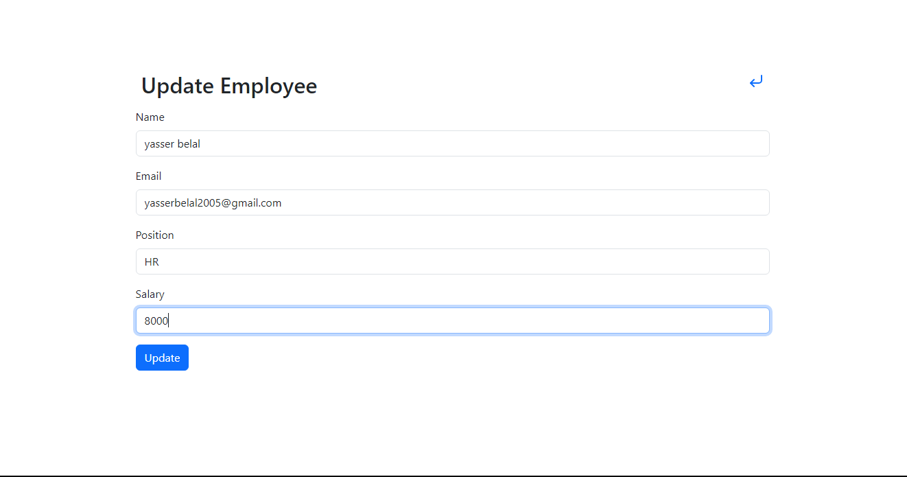
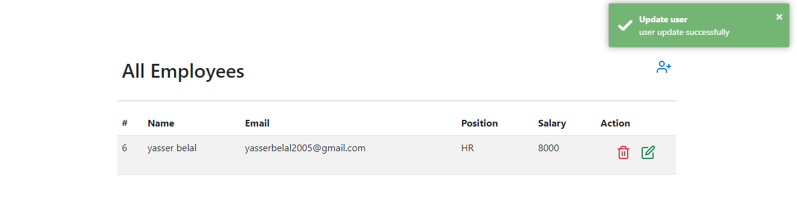
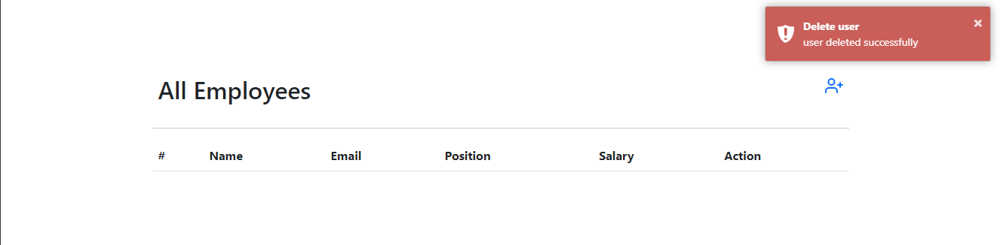
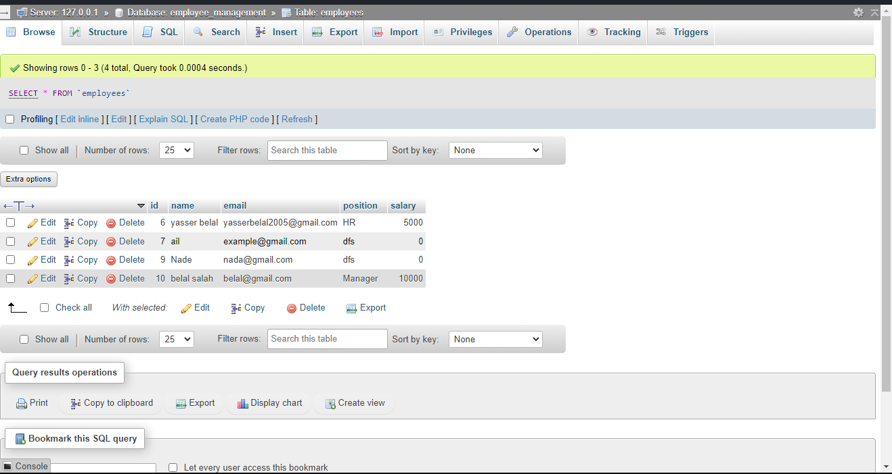

# Employee-Management-System

A comprehensive web-based application for user management and database interaction.

This project was developed as part of the GDG On Campus Zagazig Tasks. It utilizes PHP for server-side scripting and integrates with a MySQL database, showcasing core principles of web development,
including form handling, data validation, and CRUD operations. Through this project,
we gained practical experience in backend development, database design, and secure data processing — essential skills in backend web development.

## Project Details

 ### 1# Main Page
 At the start of the program. You have the option to add, update, or delete data.
 

 ### 2# Adding a new Employee
 
  
 ### 3# After adding a new Employee
 

 ### 4# After adding more Employees
  

 ### 5# Updating an existing Employee
 update the salary of Yaser Belal from 5000 to 8000
 
  
 ### 6# After updating an existing Employee
 
 
 ### 7# Delete an existing Employee
 Before deleting an employee, we check if we want to delete the employee 
 

 ### 8# After deleting an existing Employee
 

 ### 9# The Database of the website 
 

---
Thank you for caring 🌌 This Project was made by Yaser PoltX

 
